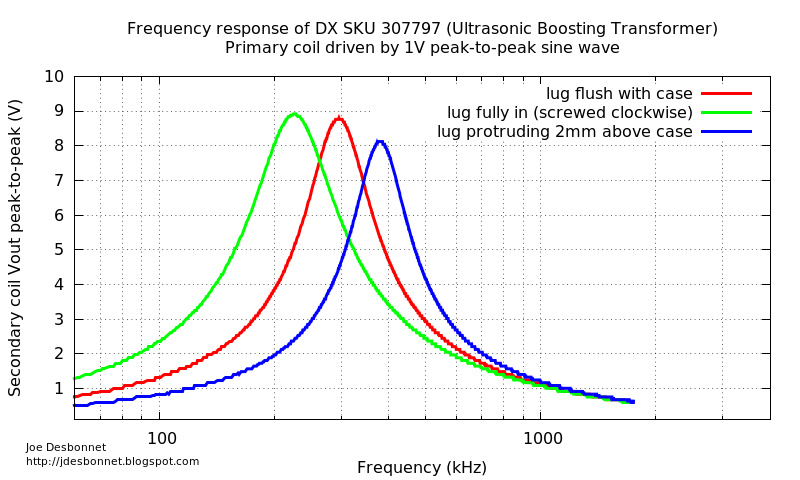

# DX.com SKU 307797 ("LSON A1M1 Ultrasonic Wave Radar Ranging Boosting Transformer")

I purchased this item (5 pieces) in the hope of providing a voltage boost to a 40kHz ultrasound transducer I'm experimenting with for distance ranging.  Unfortunately the dx.com site provides little in the way of technical specifications. ~~It turns out this transformer is designed to operate at about 300kHz. It's pretty useless at 40kHz.~~ [Update 8 Aug 2015: I had failed to measure the frequency response with the transducer in-circuit. Re-running my tests. ]

I googled "LSON A1M1" and found nothing (except on dx.com). However I did find something that looks very similar on Farnel / Element 14 with SKU 1774947 ("TRANSFORMER, 1:10, FOR 400EP18A" by PROWAVE). 
http://uk.farnell.com/prowave/k4000004/transformer-1-10-for-400ep18a/dp/1774947

Measurements that I made of the component:

* Primary coil resistance 3 ohms +/- 0.5 ohms
* Secondary coil resistance 17 ohms +/- 0.5 ohms
* Turn ratio seems to be 1:10
* The screwdriver adjustable lug can be used to adjust the resonant frequency. When fully in (screwed clockwise) resonance is at about 200kHz. When screwed out (anti-clockwise) and protruding about 2mm from the case the resonant frequency is about 400kHz. When the top of the lug is flush with the case it's about 300kHz.

The primary coil is on the side with two pins. The secondary on the side with 3 pins. The center of the three pins is not connected.

Joe Desbonnet
jdesbonnet@gmail.com
4 Aug 2015.
